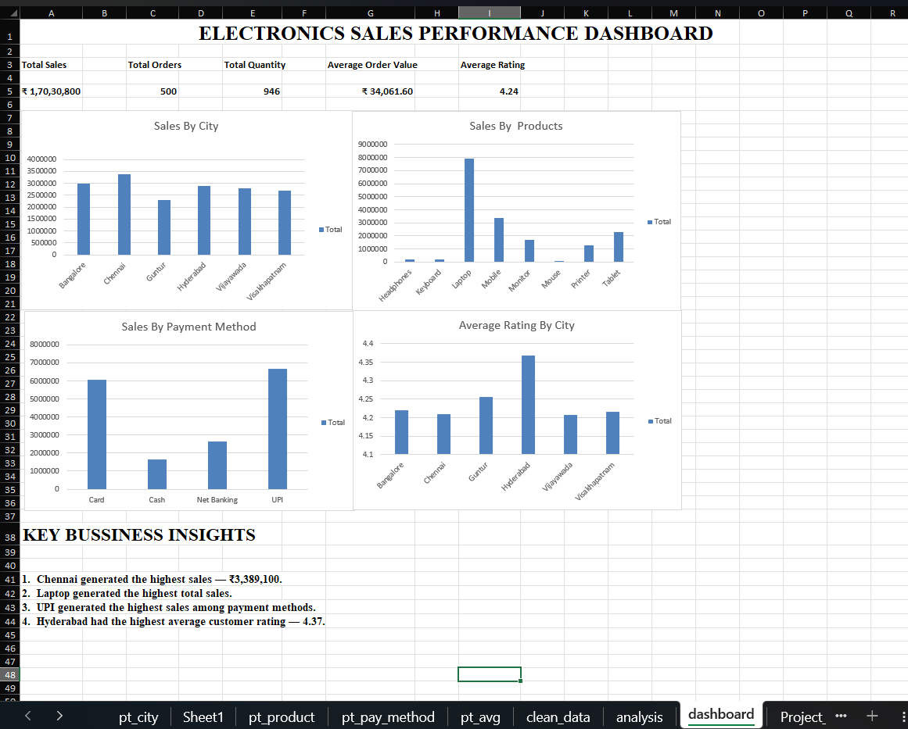

# Electronics Sales Analytics using Excel

## Project Overview

This project analyzes electronics sales data using Microsoft Excel to understand sales performance, customer behavior, product performance, payment methods, and regional sales trends.

The project demonstrates a complete Excel data analysis workflow, including data cleaning, formula-based analysis, Pivot Tables, Pivot Charts, KPI analysis, and dashboard development.

## Business Objectives

- Analyze overall sales performance
- Identify top-performing cities
- Identify high-performing products
- Analyze category performance
- Analyze payment method usage
- Identify high-value customers
- Analyze customer ratings
- Calculate key performance indicators
- Build an interactive sales dashboard
- Generate actionable business insights

## Tools & Technologies

- Microsoft Excel
- Excel Formulas
- Pivot Tables
- Pivot Charts
- Data Cleaning
- Dashboard Design
- GitHub

## Dataset

The dataset contains **500 sales orders** and includes information related to:

- Customers
- Products
- Categories
- Cities
- Payment Methods
- Quantity
- Sales
- Customer Ratings

## Key Performance Indicators

| KPI | Value |
|---|---:|
| Total Sales | ₹17,030,800 |
| Total Orders | 500 |
| Total Quantity Sold | 946 |
| Average Order Value | ₹34,061.60 |
| Average Customer Rating | 4.24 / 5 |

## Data Analysis

### Customer Analysis

Customer-level analysis was performed to understand purchasing behavior and identify high-value customers based on total sales.

### Product Analysis

Product-level sales analysis was performed to identify the products generating the highest revenue.

### Category Analysis

Sales were analyzed across product categories to identify the strongest-performing categories.

### City Analysis

City-level analysis was performed to understand regional sales performance and identify high-performing markets.

### Payment Method Analysis

Payment methods were analyzed based on sales and order volume to understand customer payment preferences.

### Customer Rating Analysis

Customer ratings were analyzed to understand overall customer satisfaction.

## Key Business Insights

### City Performance

**Chennai** generated the highest sales among the analyzed cities:

**₹3,389,100**

### Product Performance

**Laptop** was the highest-performing product by sales:

**₹7,924,500**

### Category Performance

The **Electronics** category generated the highest sales:

**₹15,270,500**

### Payment Method Performance

**UPI** generated the highest sales among payment methods:

**₹6,688,100**

UPI was also the most frequently used payment method, with:

**217 orders**

### Customer Performance

**Sneha** was the highest-sales customer:

**₹1,337,600**

### Customer Satisfaction

The average customer rating was:

**4.24 / 5**

This indicates generally positive customer feedback within the analyzed dataset.

## Excel Skills Demonstrated

### Data Preparation

- Data Cleaning
- Data Organization
- Data Validation
- Sorting and Filtering

### Data Analysis

- Excel Formulas
- KPI Calculation
- Aggregation
- Sales Analysis
- Customer Analysis
- Product Analysis
- Category Analysis
- City Analysis
- Payment Method Analysis

### Data Visualization

- Pivot Tables
- Pivot Charts
- KPI Visualization
- Dashboard Creation

## Dashboard Preview



## Project Structure

```text
Electronics-Sales-Analytics/
│
├── README.md
├── Electronics_Sales_Analytics_Project.xlsx
│
└── screenshots/
    └── dashboard.png
